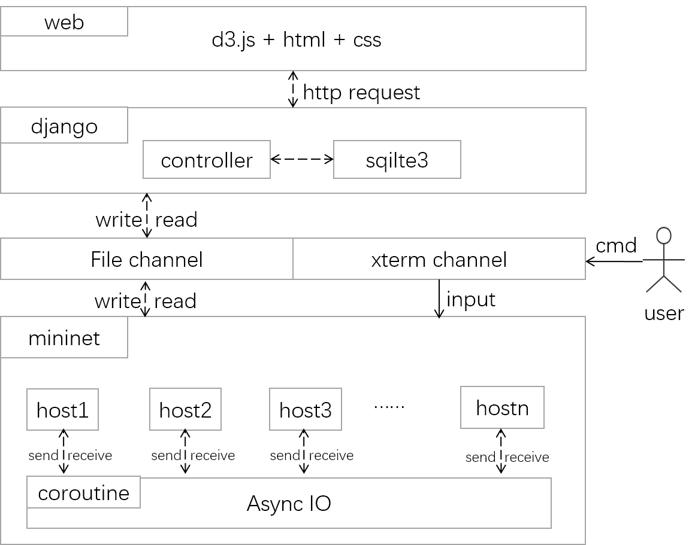
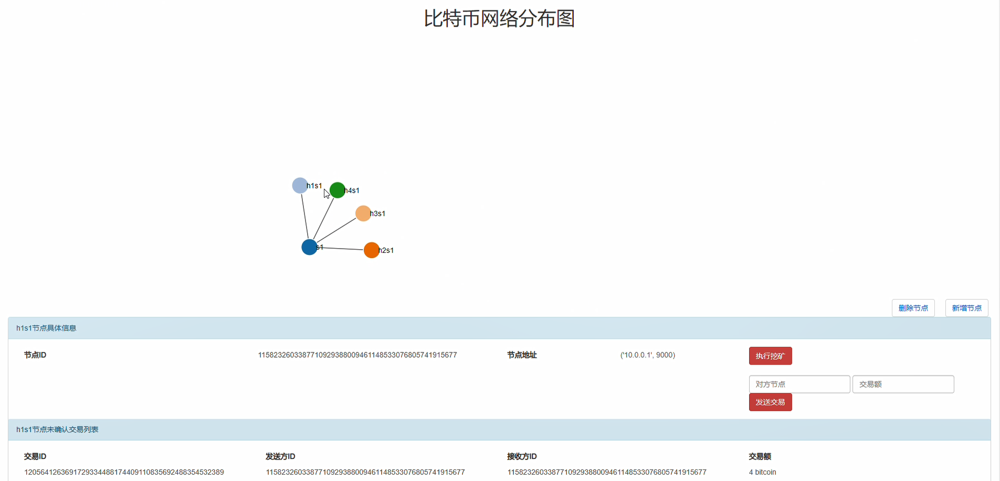
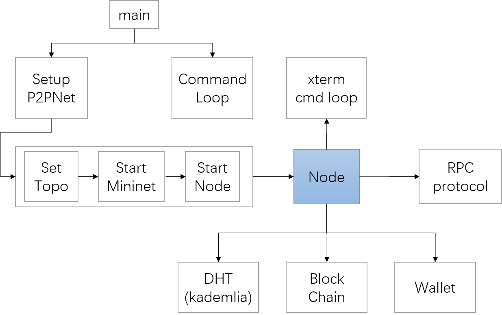
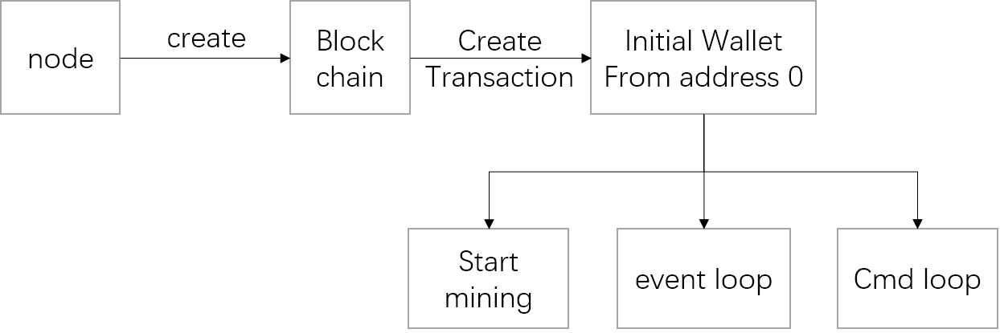
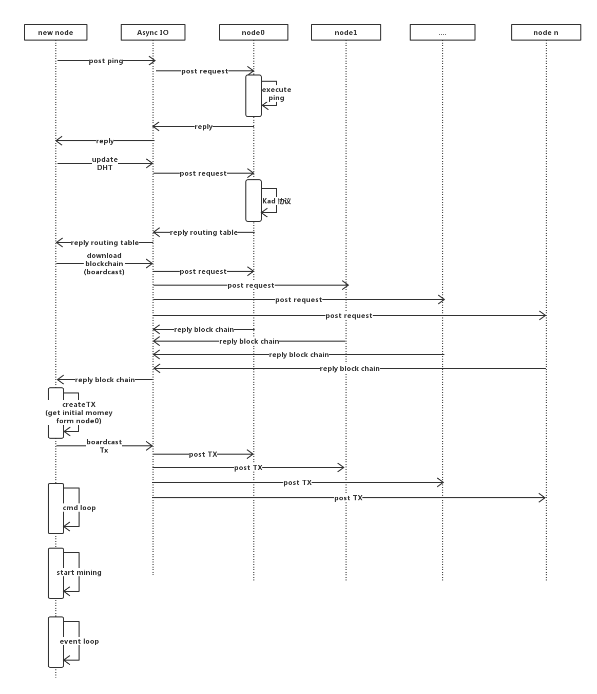
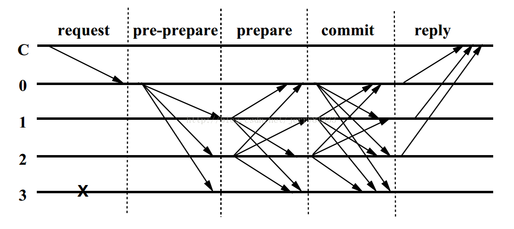

# 期末项目报告-第7组

组长: 2017213867 陈元亮\
组员: 2017213854 赵越\
&nbsp; &nbsp; &nbsp; &nbsp; &nbsp; 2017312355 梁杰\
&nbsp; &nbsp; &nbsp; &nbsp; &nbsp; 2017311694 牛惠

# 系统设计

## 1 系统架构

本项目的系统架构图如下图所示：

本项目主要分为5层，下面详细介绍

### 1.1 mininet层

Mininet 作为一个轻量级软件定义网络研发和测试平台，其主要特性包括:

- 支持 Openflow、OpenvSwitch 等软定义网络部件
- 方便多人协同开发
- 支持系统级的还原测试支持复杂拓扑、自定义拓扑
- 提供 Python API
- 很好的硬件移植性（Linux 兼容），结果有更好的说服力
- 高扩展性，支持超过 4096 台主机的网络结构

在本实验中，我们使用mininet来搭建星型、环形、树形、⽹状等不同拓扑形状的网络，并且通过限制不同链路的带宽和延迟来模拟网络的不同状况来进行实验。

mininet层主要提供了虚拟化的IP和端口，并建立代表不同节点的host实体，为Async IO层进行网络通信提供基础。

### 1.2 Async IO层

由于P2P网络需要模拟分布式的环境以及各种远程方法调用，一般的单线程/单进程编程模型难以满足模拟分布式系统的需求，因此我们引入了Python 3.x中支持的Asynic IO异步方法库，其主要支持的特性如下：

- 异步网络操作
- 并发
- 协程

我们主要用到的Asynic IO中的一些关键字如下：

- event_loop 事件循环：程序开启一个无限循环，把一些函数注册到事件循环上，当满足事件发生的时候，调用相应的协程函数
- coroutine 协程：协程对象，指一个使用async关键字定义的函数，它的调用不会立即执行函数，而是会返回一个协程对象。协程对象需要注册到事件循环，由事件循环调用。
- task 任务：一个协程对象就是一个原生可以挂起的函数，任务则是对协程进一步封装，其中包含了任务的各种状态
- future：代表将来执行或没有执行的任务的结果。它和task上没有本质上的区别
- async/await 关键字：python3.5用于定义协程的关键字，async定义一个协程，await用于挂起阻塞的异步调用接口

在具体的实验过程中，我们基于mininet提供的IP和端口，模拟出各个网络中的节点host，使用Async IO封装底层socket通信的接口进行数据通信和消息发送，从而搭建出最基础的网络架构。在此基础之上，我们还引入了路由表，以及基于Kademila协议实现了DHT分布式哈希表。

### 1.3 Channel层

本层主要实现的功能是支持外部IO输入指定的命令操作网络执行相应的功能，例如：

- 新建节点
- 删除节点
- 创建交易Transaction
- ......

主要提供了2种方式输入命令，分别是：

- 文件读取命令：通过异步调用监控输入命令文件的变化，随时执行写入命令文件的指令
- Xterm读取命令：通过在命令窗口Xterm输入相应的命令执行操作

### 1.4 Django层

Django是一个开源的Web应用框架，由Python语言编写，其主要使用了模型(model)-视图(view)-控制器(controller)模型，用一种业务逻辑、数据、界面显示分离的方法组织代码，将业务逻辑聚集到一个部件里面，在改进和个性化定制界面及用户交互的同时，不需要重新编写业务逻辑。主要结构如下：

- 模型(model)：定义数据库相关的内容，一般位于models.py文件中。
- 视图(view)：定义HTML等静态网页文件相关，包含HTML、CSS、JavaScript等前端内容。
- 控制器(controller)：定义业务逻辑相关的主要代码。

本实验使用Django框架解析前端页面发来的请求，通过相应控制器中的方法调用异步命令对P2P网络进行操作，同时将区块链、当前Transaction、当前节点地址等信息保存在本地Seqlite中，实现存储的持久化。

### 1.5 Web层

本层主要实现了可视化和页面交互的功能，通过引入D3.js可视化框架形象地展示当前网络拓扑结构，此外引入JQuery封装向后台发送的请求地址，最终实现了包含展示区块链信息，交易信息，节点动态增加和删除等功能的前端页面，提供了用户友好的区块链系统仿真交互界面。

最终页面展示效果如下图所示：

## 2 系统模块设计

本项目的系统模块图如下图所示：

本系统以`Node`模块为核心，搭建了区块链仿真系统，其功能主要包括：

- 启动星型、环形、树形、⽹状等不同拓扑形状的网络
- 通过命令控制系统执行某些操作
- 使用异步消息传递和远程方法调用实现节点间的通信
- 日志记录、DHT、实现简化版区块链和钱包
- 相关数据的序列化

下面分模块详细介绍：

### 2.1 系统启动模块

本项目从`main`函数入口启动，依次执行网络拓扑生成、启动mininet网络、注册Node节点等操作，确保各个节点能在网络中正常通信。同时会启动监控命令行输入的循环，用于接受命令行输入执行相应的指令。

### 2.2 `Node`模块

Node模块是本系统的核心模块，其主要功能有：

- 生成节点ID、路由表、本地IP、本地区块链等初始化数据结构
- 提供ping、更新路由表、下载邻居节点的区块链、挖矿等异步方法
- 保存日志、序列化区块链和钱包
- 处理广播、请求和回复等消息
- 监听文件命令行输入和Xterm命令行输入

### 2.3 `RPC`模块

`RPC`模块是基于Async IO异步方法封装的简易协议，支持功能如下：

- 发送消息，分为3类
  - 发送请求
  - 发送回复
  - 发送广播
- 处理消息，分为4类
  - 处理广播消息
  - 处理普通请求
  - 处理回复消息
  - 处理超时消息

### 2.4 `Node`子模块

包含Node中调用的重要模块，简介如下：

- 日志模块：负责保存运行时操作日志，以及序列化一些重要信息到文件系统
- DHT模块：基于Kademila协议实现分布式哈希表
- 区块链模块：基本实现了生成区块、proof验证、PoW工作量证明等方法
- 钱包模块：用于计算当前节点剩余的财产

## 3 创世节点启动流程

本项目的创世节点启动流程如下图所示：

过程如下：

- 当一个节点在启动加入网络后ping过预先定义的节点后发现路由表为空
- 该节点新建区块链，新建新的空钱包
- 该节点创造一个新的交易，从地址为0的特殊节点获取若干比特币
- 该节点开始挖矿，加交易打包进创世区块
- 创世节点启动完毕，开始监听各种消息，根据命令输入发出相应消息

## 4 其它节点启动时序

本项目的其它节点启动时序图如下图所示：

其他节点的启动时进行的操作如下：

- 向初始节点发动ping请求，得到相应回复
- 发送请求更新DHT，得到路由表信息
- 向邻居节点发送拉取区块链的消息，对收到的区块链进行长度的比较，保留最长的链，并序列化到本地
- 收到相应命令时经过验证新建交易，并广播该交易给邻居节点
- 启动命令监控循环
- 新开线程，执行挖矿逻辑
- 启动事件的监听和响应操作

 

# 核心算法设计与实现

## 5 PoW共识算法设计与实现

本实验对PoW共识算法进行了简易模拟，主要流程如下：

1. 所有节点启动完毕后，新开一个线程，执行挖矿逻辑
2. 某个节点一旦挖到某个block后，从transaction池中拉取TX，验证并放入新的block中
3. 该节点将new block 广播出去后，继续挖下一个区块
4. 某一节点一旦收到某个new block，立即发送一个信号量，停止当前挖矿行为
5. 验证该收到的new block
   - 5.1 如果验证通过，则将该new block添加到自己的链上
   - 5.2 验证不通过：
     - 5.2.1 从自己的routing table中的所有邻居节点拉取区块链
     - 5.2.2 逐个与自身区块链进行对比
       - 5.2.2.1 若区块链比自己的长，则用该区块链覆盖掉自己的链
       - 5.2.2.2 若区块链与自己的一样长，寻找fork分支点，进行fork操作
6. 继续挖下一个区块

PoW共识算法通过进行一定的运算和消耗一定的时间来计算一个合适的工作量值提供给各节点快速验证，以防止区块链系统被算力攻击导致的数据资源滥用，确保区块链上交易的公平和安全。

### 5.1 PoW算法实现验证 —— 模拟双花操作：

为了验证PoW算法的有效性，我们设计了相应的场景以模拟算法是否正确的发挥作用。

我们随机选择某一节点将某笔钱分别不同节点发送两次，经过实验模拟，发现同一时刻，只有一个交易会被确认，双花发生概率为0.

PS：另一笔交易会在将来某个时候该节点中钱包的余额大于交易额时，被其他人或自己所确认，最终花费出去，钱包余额再次减少。

## 6 POS共识算法设计与实现

PoS(Proof of stake)直观来看就是拥有更多财产的节点，有更大的概率获得记账权，然后获得奖励。具体模拟的过程如下：

1. 每个节点根据当前钱包中的比特币数量num从[0,num]随机生成一个值，代表其权益大小，并且向所有节点广播。
2. 当所有节点都收到来自其他节点的权益广播后，将记账权赋予当前具有最大权益值的节点。
3. 具有记账权的节点将该节点上的交易验证后打包进区块，计算hash之后广播该区块。
4. 其余节点收到广播的区块，经过验证后将其加到区块链的尾部，完成区块链的增长。

## 7 PBFT共识算法设计与实现

- 发起节点i,创建block，调用1号节点，pre-prepare(self.id, block）
- 1号节点发送广播（除发起节点i外），调用其它结点的prepare方法
- 所有节点的prepare方法里广播调用其它结点的prepare方法，计数自己被调用次数，若结果大于一半的N，则广播调用commit方法
- commit方法里计数被调了多少次，若大于一半的N，则记录这个block, 同时调用交易节点的reply方法
- 交易结点的reply方法里计数，若大于一半的N，记录这个block,钱包扣钱， 调用大家的计数清零函数

 

# 攻击仿真实验

## 8 不同算力攻击成功概率

为了统计不同算力占比的条件下攻击成功额概率，这里使用双花攻击的场景进行模拟，流程如下：

1. 攻击节点一旦挖到新的区块时，除了从transaction池中拉取TX外，立即新建一个TX，花费自己所有的钱，给-1号地址（模拟取现过程），并创建两个new block，block1 包含该TX，block2不包含这个TX
2. 攻击节点给正常节点发送block1，给攻击节点发送block2
3. 正常节点收到该block时，会校验block1的合法性，发现正常，确认该TX，此时取现过程被确认，攻击者取到第一笔现金
4. 攻击节点收到该block时，会校验block2的合法性，正常，接收该block
   - 4.1 若攻击节点再次挖到新的区块，除了从transaction池中拉取TX外，立即新建一个TX，再次花费自己所有的钱，给-1号地址（模拟取现过程），重复1步骤
     - 4.1.1 攻击节点收到块，验证，不冲突，加入区块链
     - 4.1.2 正常节点收到块，验证，冲突，拉取其它节点的区块链，若链比自己长，则覆盖（最终上次的取现交易被覆盖掉，成功双花）
   - 4.2 若正常节点再次挖到新的区块，则进行正常逻辑，区块链正常运行
5. 一段时间后，观察攻击节点给-1号地址的TX的所有金额，即全部取现金额，若金额大于本身比特币金额，则表示攻击成功。
6. 记录不同算力下攻击成功概率

### 8.1 模拟实验结果：

| 攻击者算力占比 | 20% | 40% | 60% | 80% |
|----------------|-----|-----|-----|-----|
| 攻击成功概率   |  2/38   |  7/48   |  9/35   |  22/65   |

注：A/B A表示攻击者提现次数，B表示挖矿的总轮数

## 9 不同带宽下分叉概率

通过设置mininet中不同link的bw(带宽)和delay(延迟)，记录区块链发生分叉的概率

| 带宽(MB)/延迟(ms) | 1000MB/0ms | 100MB/1ms | 10MB/0ms | 10MB/100ms | 10MB/1000ms | 1MB/1000ms |
|----------------|-----|-----|-----|-----|-----|-----|
| 分叉概率   |  0/(20*5)   |   0/(20*5)   |   0/(20*5)   |   0/(20*5)   |  4/(20*5)    |  12/(20*5)    |

注：A/(B*N) A表示分叉出现的次数，B表示挖矿的总轮数,N表示节点数

## 10 BGP劫持攻击模拟

### 10.1 BGP劫持攻击

根据相关资料，我们模拟的BGP劫持攻击的流程如下：

1. 攻击者发动BGP劫持，将网络分割为**两部分**（先前2个网络正常连通并挖矿），一个大网络、一个小网络。用mininet可以限制2个网络之间的延迟，延迟设为无穷大则视为ping不通，即2个网络发生分割。
2. 在小网络中，攻击者发布交易卖出自己全部的加密货币，并兑换为法币。页面展示为攻击者生成transaction，钱包余额转移到某个特殊地址（例如“1”）。
3. 经过小网络的“全网确认”生成新block，这笔交易生效，攻击者获得等值的法币，攻击者节点钱包余额为0。
4. 攻击者释放BGP劫持，大网络与小网络互通，小网络上的一切交易被大网络否定（大网络区块链长于小网络），攻击者的加密货币全部回归到账户，而交易得来的法币，依然还在攻击者手中，完成获利。即攻击者节点区块链被大网络覆盖，钱包余额恢复至小网络区块链分叉前状态。

 

# 实验内容完成情况

项目所有代码以开源至git，地址为https://github.com/131250106/bitcoin, git上代码统计行数为(11,681 ++  1,283 --)

- [x] **实验一：P2P网络仿真**
  - [x] 使⽤Mininet搭建不同拓扑的网络（如星型、环形、树形、网状）限制不用链路的带宽		——具体实现，详见源码myTopo.py
  - [x] 每个结点可以生成某种类型的数据，结点间进行通信，在本地建立数据库，记录不同节点的地址，以及各个结点的数据类型		——具体实现，详见源码myNode.py和myRoutingTable.py
  - [x] 在不同的节点间传输数据（不同大小，多个数量）		——具体实现，详见源码myNode.py,myRoutingTable.py和myRPC.py

---

- [x] **实验二：区块链仿真**
  - [x] 在实验一的基础上，实现区块链网络的仿真		——具体实现，详见源码myNode.py和myBlockChain.py
  - [x] 模拟p2p网络的交易（区块）及其传播逻辑		——具体实现，详见源码myNode.py和myBlockChain.py
  - [x] 实现PoW算法模拟挖矿									——具体实现，详见源码myNode.py和myBlockChain.py
  - [x] 限制链路带宽，测试在不同区块大小及区块产⽣间隔的情况下的网络时延状况、分叉状况						——具体实现，详见源码myTopo.py
  - [x] 使⽤PBFT协议进⾏共识											——具体实现，详见源码myPBFTNode.py

---

- [x] **实验三：攻击仿真**
  - [x] 在实验二仿真的比特币网络基础上进行实验		——具体实现，详见源码setupNode.py和myNode.py
  - [x] 进行仿真实验，记录不同的算力攻击下，攻击成功（可以产生更长的链使现有的某些区块无效）的概率		——具体实现，详见源码setupNode.py和myNode.py
  - [x] 选做BGP劫持、Eclipse攻击				——具体实现，详见源码setupNode.py和myNode.py

---

- [x] **实验四：探索新的共识算法**
  - [x] 探索其它共识方法如proof of stake/proof of retrievability等			——具体实现，详见源码myNode.py中的startPOS函数

# 演示形式
//TODO
